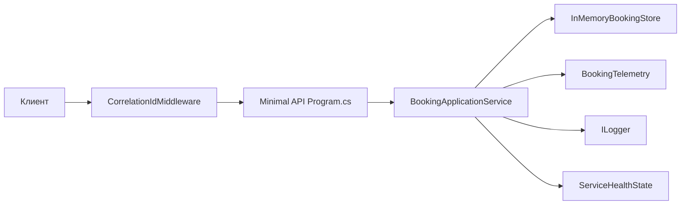

# BookingService — отчёт по эксплуатации и документация

Учебная веб-служба на ASP.NET Core, моделирующая **четырёхшаговое бронирование переговорки** с идемпотентностью по событию, компенсацией при сбое шага, журналированием со сквозным **Correlation ID** и метриками в формате Prometheus.

---

## 1. Требования и запуск

| Параметр | Значение |
|----------|----------|
| Платформа | .NET 11 (preview SDK допустим) |
| Решение | `PR4 Batov.sln` |
| Проект | `BookingService/BookingService.csproj` |

**Запуск из корня репозитория:**

```bash
dotnet run --project BookingService
```

URL по умолчанию задаётся в `BookingService/Properties/launchSettings.json` (часто `http://localhost:5139`). Другой адрес:

```bash
dotnet run --project BookingService --urls http://localhost:8080
```

**Сборка:**

```bash
dotnet build BookingService
```

**Готовые HTTP-примеры** для IDE (REST Client / VS Code): файл `BookingService/BookingService.http`.

---

## 2. Назначение ключей (эксплуатация)

| Понятие | Где задаётся | Назначение |
|---------|--------------|------------|
| **Ключ процесса** | Путь URL: `/api/processes/{processKey}/...` | Однозначно идентифицирует экземпляр саги бронирования. Состояние хранится в памяти по этому ключу. |
| **Ключ идемпотентности** | JSON-тело: `idempotencyKey` | Однозначно идентифицирует **доставку события** в рамках процесса. Повтор с тем же ключом не меняет состояние и учитывается как redelivery. |
| **Correlation ID** | Заголовок `X-Correlation-Id` (необязательно) | Связывает записи в журнале и поле `correlationId` в ответе; при отсутствии заголовка генерируется и возвращается в ответе. |

Данные процессов **не переживают перезапуск** приложения (in-memory store).

---

## 3. Файлы проекта и зона ответственности

Корень решения: `PR4 Batov.sln` — объединяет проект службы.

### 3.1. Точка входа и конфигурация

| Файл | Ответственность |
|------|-----------------|
| `BookingService/Program.cs` | Регистрация DI, OpenTelemetry (метрики + Prometheus), health checks, маршруты API, middleware, OpenAPI в Development. |
| `BookingService/BookingService.csproj` | Зависимости NuGet (OpenTelemetry, OpenAPI и т.д.). |
| `BookingService/appsettings.json` | Общие настройки, секция `Health`. |
| `BookingService/appsettings.Development.json` | Переопределения для среды Development (в т.ч. `Health`). |
| `BookingService/Properties/launchSettings.json` | Профиль `dotnet run`, URL и переменная `ASPNETCORE_ENVIRONMENT`. |

### 3.2. Доменная модель

| Файл | Ответственность |
|------|-----------------|
| `BookingService/Domain/BookingState.cs` | Перечисление состояний конечного автомата (`Pending` → … → `Completed`). |
| `BookingService/Domain/BookingEventType.cs` | Типы событий: `ReserveRoom`, `ConfirmDetails`, `CapturePayment`, `SendConfirmation`. |
| `BookingService/Domain/ProcessSnapshot.cs` | DTO снимка процесса для API (состояние, ключи, ошибка, число компенсаций). |

### 3.3. Бизнес-логика и хранение

| Файл | Ответственность |
|------|-----------------|
| `BookingService/Services/InMemoryBookingStore.cs` | Потокобезопасный словарь процессов `ConcurrentDictionary`, класс `ProcessInstance` (состояние, исходы по idempotency, блокировка `lock` на процесс). |
| `BookingService/Services/BookingApplicationService.cs` | **Ядро:** проверка идемпотентности, допустимость перехода, успешные переходы, симуляция сбоя, **компенсация ReleaseRoom** (сброс в `Pending`), запись в телеметрию и логи с `CorrelationId`. |
| `BookingService/Services/ServiceHealthState.cs` | Счётчик подряд идущих ошибок шагов для readiness; сброс при успехе. |

### 3.4. Наблюдаемость и здоровье

| Файл | Ответственность |
|------|-----------------|
| `BookingService/Telemetry/BookingTelemetry.cs` | `Meter` с счётчиками успехов/ошибок/redelivery/компенсаций и гистограммой задержки по событию. |
| `BookingService/Middleware/CorrelationIdMiddleware.cs` | Чтение/генерация correlation id, заголовок ответа, `ILogger` scope на время запроса. |
| `BookingService/Health/ReadinessHealthCheck.cs` | Проверка готовности: симуляция деградации из конфига или порог `ConsecutiveStepFailures`. |
| `BookingService/Options/HealthOptions.cs` | Параметры `CriticalFailureThreshold`, `SimulateCriticalDegradation`. |

### 3.5. HTTP API (контракты)

| Файл | Ответственность |
|------|-----------------|
| `BookingService/Api/BookingDtos.cs` | Модели запроса/ответа для событий и статуса процесса. |
| `BookingService/Api/HttpContextExtensions.cs` | Получение correlation id из `HttpContext.Items`. |
| `BookingService/BookingService.http` | Примеры вызовов: health, метрики, happy path, redelivery, сбой с компенсацией. |

---

## 4. Как компоненты взаимодействуют

Ниже — логическая цепочка одного HTTP-запроса с событием.



1. **CorrelationIdMiddleware** выполняется первым: в контексте запроса появляется correlation id, в логах — scope, в ответе — заголовок `X-Correlation-Id`.
2. **Minimal API** (`Program.cs`) извлекает тело (`PostEventRequest`), вызывает `BookingApplicationService.HandleEvent`.
3. **InMemoryBookingStore** возвращает или создаёт `ProcessInstance` для `processKey`; внутри экземпляра **lock** сериализует обработку событий одного процесса.
4. **BookingApplicationService**:
   - при уже известном `idempotencyKey` возвращает закэшированный исход, пишет лог «redelivery», увеличивает счётчик redelivery в метриках;
   - иначе проверяет соответствие события текущему состоянию, при `simulateFailure` после нетривиального состояния выполняет компенсацию и сброс в `Pending`;
   - при успешном переходе обновляет состояние, метрики успеха, сбрасывает счётчик ошибок readiness;
   - при недопустимом событии — метрика ошибки, рост счётчика ошибок для readiness, запись в лог.
5. **BookingTelemetry** обновляет показатели, которые отдаёт эндпоинт **`/metrics`** (Prometheus scrape).
6. **ReadinessHealthCheck** читает `ServiceHealthState` и `IOptions<HealthOptions>` — при «критической деградации» readiness возвращает неуспех.

---

## 5. HTTP-интерфейс (эксплуатация)

### 5.1. Событие процесса

`POST /api/processes/{processKey}/events`  
`Content-Type: application/json`

Пример тела:

```json
{
  "idempotencyKey": "step-1",
  "event": "ReserveRoom",
  "simulateFailure": false
}
```

Значения `event` (строка в JSON, camelCase): `reserveRoom`, `confirmDetails`, `capturePayment`, `sendConfirmation` — в зависимости от политики JSON (в проекте включён `JsonStringEnumConverter` для enum).

Ответ содержит: `correlationId`, `state`, `applied`, `duplicate`, `compensated`, `message`.

### 5.2. Статус процесса

`GET /api/processes/{processKey}` — текущее состояние, список применённых ключей идемпотентности по порядку, последняя ошибка (если была), счётчик компенсаций. **404**, если процесс с таким ключом ещё ни разу не создавался (не было ни одного POST).

### 5.3. Здоровье

| Маршрут | Назначение |
|---------|------------|
| `GET /health/live` | Упрощённая проверка живости (процесс отвечает). |
| `GET /health/ready` | Готовность принимать нагрузку; неуспех при симуляции или при превышении порога подряд идущих ошибок шагов. |
| `GET /health/live-detailed` | Детальный health с тегом `live` (встроенная проверка `self`). |

Настройки в `appsettings.json`, секция **`Health`**:

- `CriticalFailureThreshold` — после стольких подряд неуспешных переходов readiness становится unhealthy.
- `SimulateCriticalDegradation` — если `true`, readiness всегда unhealthy (демонстрация критической деградации).

### 5.4. Метрики

`GET /metrics` — текстовый формат Prometheus. Имена с префиксом `booking_` (например `booking_transitions_success_total`, `booking_events_redelivery_total`, `booking_compensations_total`, гистограмма задержек по событию).

### 5.5. OpenAPI

В среде **Development** доступен OpenAPI (см. `Program.cs` и `BookingService.http`).

---

## 6. Сценарии работы (оператор / разработчик)

### Успешное прохождение всех шагов

Один и тот же `processKey`, **разные** `idempotencyKey` на каждый шаг, события строго по порядку состояний:

1. `ReserveRoom`  
2. `ConfirmDetails`  
3. `CapturePayment`  
4. `SendConfirmation`  

После шага 4 состояние — `Completed`.

### Повторная доставка

Повторить **тот же** запрос (тот же `processKey`, тот же `idempotencyKey` и тот же смысл события). В ответе `duplicate: true`, состояние не меняется; в логах — сообщение о redelivery; метрика redelivery увеличивается.

### Сбой и компенсация

После успешного `ReserveRoom` отправить, например, `ConfirmDetails` с `"simulateFailure": true`. Ожидается: компенсация `ReleaseRoom`, состояние снова `Pending`, `compensated: true`, счётчик компенсаций на GET статуса увеличен.

### Проверка деградации readiness

Сгенерировать серию недопустимых событий или симулируемых сбоев, пока счётчик подряд идущих ошибок не достигнет порога, либо выставить `Health:SimulateCriticalDegradation` в `true` и перезапустить приложение.

---

## 7. Журналирование

Уровень по умолчанию задаётся в `appsettings*.json`. В сообщениях фигурируют **структурированные поля**: `ProcessKey`, `Event`, `State`, `CorrelationId`, причины отказов, компенсации, redelivery. Correlation id также пробрасывается через **logging scope** middleware (удобно в системах, которые отображают scope).

---

## 8. Ограничения и замечания по эксплуатации

- Память процесса **не персистентна**: перезапуск приложения обнуляет все процессы.
- Для Prometheus используется beta-пакет экспортера; при сборке NuGet может сообщать об известных уязвимостях транзитивных зависимостей — для продакшена следует отслеживать обновления стабильных версий OpenTelemetry.
- Один тип компенсации: **освобождение переговорки** (`ReleaseRoom`) при сбое шага, когда процесс уже выходил из `Pending`.

---

## 9. Краткая карта каталогов

```
PR4 Batov.sln
BookingService/
  Program.cs                 — хост, маршруты, DI
  appsettings*.json          — конфигурация
  BookingService.http        — примеры запросов
  Api/                       — DTO и хелперы HTTP
  Domain/                    — состояния и события
  Services/                  — хранилище, сага, здоровье по ошибкам
  Telemetry/                 — метрики Meter
  Middleware/                — correlation id
  Health/                    — readiness check
  Options/                   — сильно типизированные опции
  Properties/launchSettings.json
```

Этого README достаточно для сдачи лабораторной или для быстрой передачи смене эксплуатации: запуск, ключи, файлы, взаимодействие и типовые сценарии.
